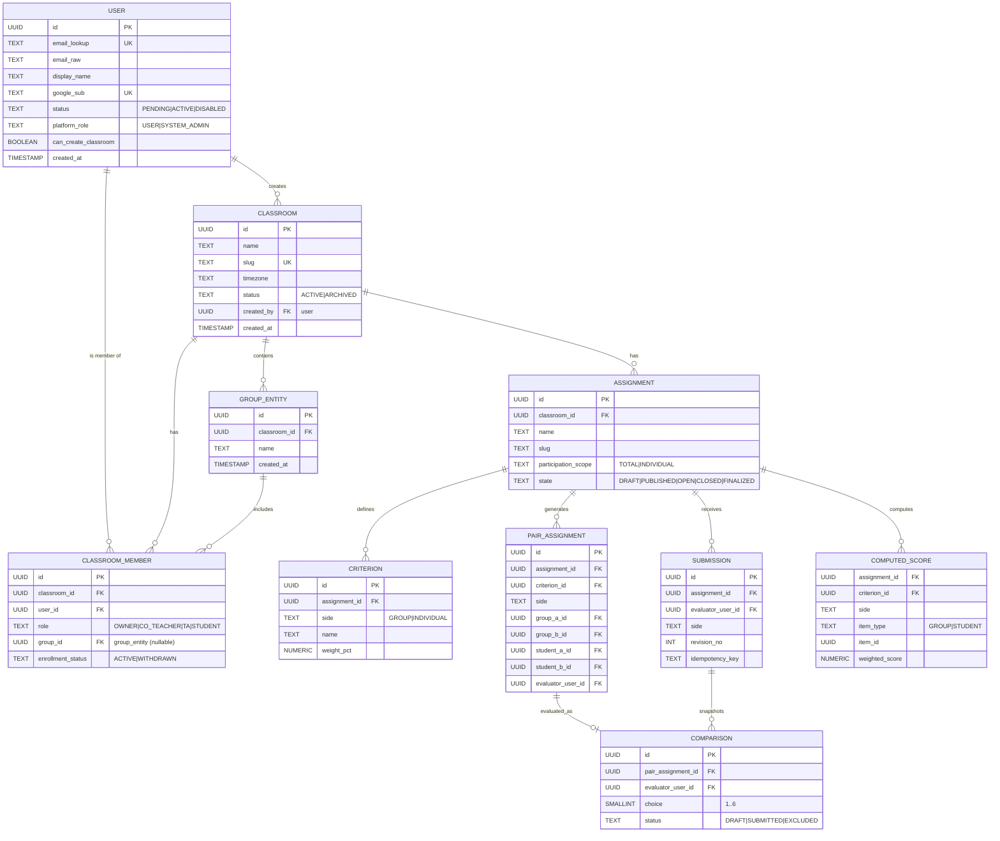

# Entity Relationship Diagram (ERD)

```mermaid
erDiagram
    USER {
        UUID id PK
        TEXT email_lookup UK
        TEXT email_raw
        TEXT display_name
        TEXT google_sub UK
        TEXT status "PENDING|ACTIVE|DISABLED"
        TEXT platform_role "USER|SYSTEM_ADMIN"
        BOOLEAN can_create_classroom
        TIMESTAMP created_at
    }

    CLASSROOM {
        UUID id PK
        TEXT name
        TEXT slug UK
        TEXT timezone
        TEXT status "ACTIVE|ARCHIVED"
        UUID created_by FK "user"
        TIMESTAMP created_at
    }

    GROUP_ENTITY {
        UUID id PK
        UUID classroom_id FK
        TEXT name
        TIMESTAMP created_at
    }

    CLASSROOM_MEMBER {
        UUID id PK
        UUID classroom_id FK
        UUID user_id FK
        TEXT role "OWNER|CO_TEACHER|TA|STUDENT"
        UUID group_id FK "group_entity (nullable)"
        TEXT enrollment_status "ACTIVE|WITHDRAWN"
    }

    ASSIGNMENT {
        UUID id PK
        UUID classroom_id FK
        TEXT name
        TEXT slug
        TEXT participation_scope "TOTAL|INDIVIDUAL"
        TEXT state "DRAFT|PUBLISHED|OPEN|CLOSED|FINALIZED"
    }

    CRITERION {
        UUID id PK
        UUID assignment_id FK
        TEXT side "GROUP|INDIVIDUAL"
        TEXT name
        NUMERIC weight_pct
    }

    PAIR_ASSIGNMENT {
        UUID id PK
        UUID assignment_id FK
        UUID criterion_id FK
        TEXT side
        UUID group_a_id FK
        UUID group_b_id FK
        UUID student_a_id FK
        UUID student_b_id FK
        UUID evaluator_user_id FK
    }

    COMPARISON {
        UUID id PK
        UUID pair_assignment_id FK
        UUID evaluator_user_id FK
        SMALLINT choice "1..6"
        TEXT status "DRAFT|SUBMITTED|EXCLUDED"
    }

    SUBMISSION {
        UUID id PK
        UUID assignment_id FK
        UUID evaluator_user_id FK
        TEXT side
        INT revision_no
        TEXT idempotency_key
    }

    COMPUTED_SCORE {
        UUID assignment_id FK
        UUID criterion_id FK
        TEXT side
        TEXT item_type "GROUP|STUDENT"
        UUID item_id
        NUMERIC weighted_score
    }

    %% Relationships
    USER ||--o{ CLASSROOM : creates
    USER ||--o{ CLASSROOM_MEMBER : "is member of"
    CLASSROOM ||--o{ CLASSROOM_MEMBER : has
    CLASSROOM ||--o{ GROUP_ENTITY : contains
    CLASSROOM ||--o{ ASSIGNMENT : has
    GROUP_ENTITY ||--o{ CLASSROOM_MEMBER : includes
    
    ASSIGNMENT ||--o{ CRITERION : defines
    ASSIGNMENT ||--o{ PAIR_ASSIGNMENT : generates
    ASSIGNMENT ||--o{ SUBMISSION : receives
    ASSIGNMENT ||--o{ COMPUTED_SCORE : computes
    
    PAIR_ASSIGNMENT ||--o| COMPARISON : evaluated_as
    SUBMISSION ||--o{ COMPARISON : snapshots
```
